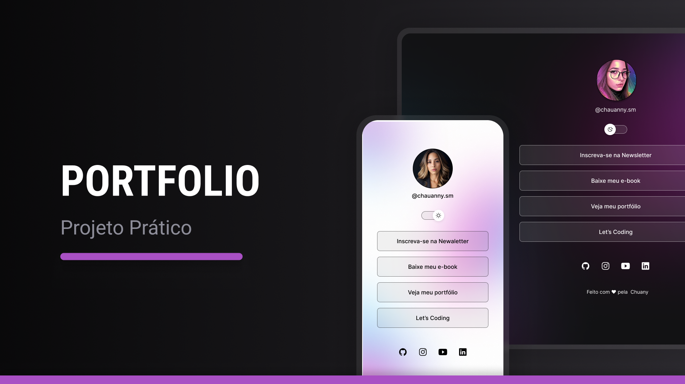

<h1 align="center"> Projeto Profile </h1>

Programa prático e aplicação de tecnologias WEB.  

 

  

## 🚀 Tecnologias

Esse projeto foi desenvolvido com as seguintes tecnologias:

- HTML e CSS
- JavaScript
- Git e Github
- Figma

## 💻 Projeto

O Projeto Profile é uma aplicação onde podemos acessar por meio de links outras redes servido como cartão de visitas online de forma de dinâmica. 
- [Acesse o projeto finalizado, online](https://github.com/chauvmedeiros/Profile)

## 🔖 Layout

Você pode visualizar o layout do projeto através [DESSE LINK](https://figma.com). É necessário ter conta no [Figma](https://figma.com) para acessá-lo.

## :memo: Licença

Esse projeto está sob a licença MIT.
 

---

Feito com ♥ by Chauanny :wave: [Participe da nossa comunidade!](https://discord.gg/YwXJDaZ5)
